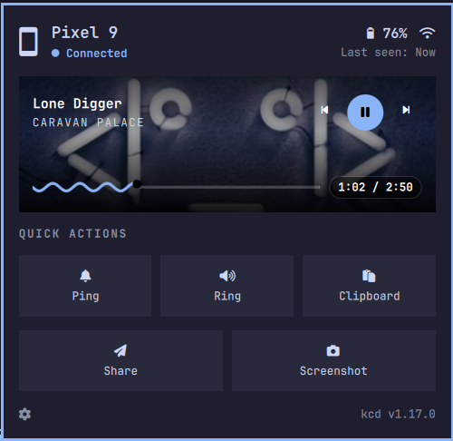
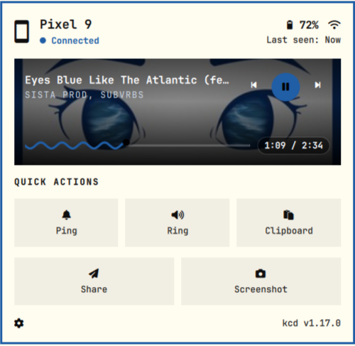
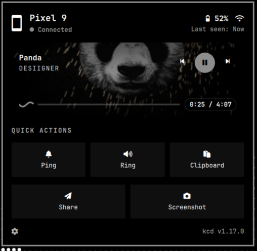

# Omarchy KCD

[](LICENSE)
[](https://github.com/bethropolis/omarchy-kcd-plugin/actions)
[](https://omarchy.org)
[](https://github.com/tcballard/omarchy-badges)


An Omarchy Quattro `bar-widget` plugin for
[`kcd`](https://github.com/bethropolis/kcd), a KDE Connect protocol
daemon written in Go. Surfaces your phone in the bar and in a
dashboard panel: device status, battery, now-playing card with
transport controls, and single-press quick actions.


## Previews

| Catppuccin | Flexoki | Vantablack |
|---|---|---|
|  |  |  |


## Requires

* Omarchy Quattro (`omarchy-shell`)
* `kcd` daemon >= 1.18.0 with a paired phone

## Install

### kcd daemon

This plugin is a frontend, you need to install the daemon first.

#### Arch Linux

Install from the AUR using your preferred helper:

```bash
yay -S kcd-bin
```

Then enable the socket so the daemon starts on demand at login
(the service unit stays installed for activation, but disabled):

```bash
systemctl --user enable --now kcd.socket
```

Cold client commands (including this panel's probes) summon the daemon
on first use, so there is normally nothing to start by hand.

For other configurations and protocol details, see the
official [`kcd` repo](https://github.com/bethropolis/kcd).

### Plugin

```sh
omarchy plugin add https://github.com/bethropolis/omarchy-kcd-plugin.git --enable
```

## Usage

* Bar shows battery level (dimmed when offline). Left-click toggles the
  panel, middle-click refreshes.

* Panel header: phone, link icon (tooltip shows the phone's reported
  network type when available), battery, last-seen.

* Media card: album art, title/artist, prev / play-pause / next, wave
  seeker with smooth playhead.

* Quick actions: **Ping**, **Ring**, **Clipboard**, **Share**,
  **Screenshot** (live). Share
  picks one file with the native chooser (`omarchy-file-select`) and sends
  it via `kcd share`, reporting back as a desktop notification.
  Screenshot captures the focused monitor with `grim` (after the panel
  hides itself) and sends the PNG the same way. Captures stage as
  temporary `/tmp` files (never the cache dir) because `kcd share`
  returns on invitation while the daemon opens the file seconds later;
  the staged file is deleted on `share.complete` (stale ones pruned
  after an hour, the rest vanish on reboot), and the notification only
  claims success then.

* No paired phone? **Start pairing** runs `kcd pair -y` (auto-accepts the
  first request, then stops). Daemon down? **Start daemon** primes the
  socket, then the next probe wakes the daemon on its own.

* Footer gear opens `kcd.toml` in Neovim. Footer right shows the live
  `kcd <version>`; click it to open `bethropolis/kcd` on GitHub.

* Scriptable through the shell like any widget (toggle the panel from a
  keybind, close it on lock):


## How it works

The panel boots from one `kcd watch --json` snapshot (devices + battery +
media), then stays live on watch events. Position is drift-free math from
the daemon's anchor stamp. Pure parsing lives in `Kcd.js` (Qt-free,
testable under bun):

```sh
bun test tests/
```

## Files

| File | Purpose |
|---|---|
| `manifest.json` | Plugin contract (`bar-widget` → `BarWidget.qml`) |
| `BarWidget.qml` | Bar button, mirrors panel state |
| `Panel.qml` | Dashboard panel, owns all kcd IO |
| `QuickTile.qml` | Quick-action tile component (+ `accent` primary style) |
| `KcdMissing.qml` / `KcdUnpaired.qml` | Empty-state panels |
| `Kcd.js` | Device/track/event parsing + CLI argv builders |
| `kcd-share.sh` | Share flow: native pick → `kcd share` → notification |
| `kcd-screenshot-share.sh` | Screenshot flow: `grim` → `/tmp` stage → `kcd share` → delete on `share.complete` |
| `tests/kcd.test.js` | Bun suite for the `Kcd.js` helpers (`bun test tests/`) |

## Customization

This repo bundles the official kcd client docs under `docs/`
(`CLIENT_GUIDE.md`, `IPC_PROTOCOL.md`), so anyone can extend the panel
with features skipped here. The pattern for a new quick action:

1. Add an argv builder in `Kcd.js` next to `tileCommand` (pure function,
   covered by `bun test tests/`).
2. Add a `QuickTile` in `QuickActionsRow.qml` with a FontAwesome-range
   glyph (the panel font lacks the Material block).
3. Wire the signal through `Panel.qml` into a `KcdIo.qml` spawn function,
   following `shareScreenshot()`.

Long-running work (watch streams, pairing listen mode) belongs in
managed `Process` blocks in `KcdIo.qml`. One-shot sends go through
`Quickshell.execDetached` like the tile commands.

## Remove

```sh
omarchy plugin remove io.github.bethropolis.kcd
```

This deletes the plugin folder; the shell drops the bar widget
automatically. The `kcd` daemon and its pairing stay installed, remove
those separately if you no longer need them.

## License

MIT. See [LICENSE](LICENSE).
